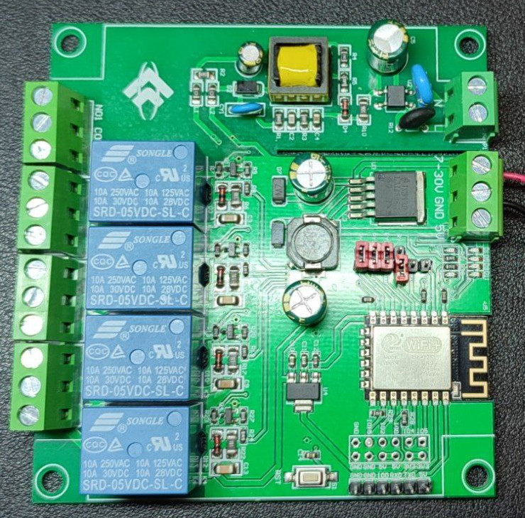

# Esp12E 4 Relays Board

This folder contains the example code used on a ESP8266 board with 4 Relays.
The code is a [PlatformIO](https://platformio.org/) project. You can open this folder as a project and adapt the code to your own needs.

In this case, the code is for the control of all the four Relays.



# Quick start

The only file to create for the correct operation is the ```credentials.h``` file, in the ```src``` folder. It's possible to start creating this file from the ```credentials.h.example``` file, in the same folder.
It's important to adapt the first four variables:
```
const char* ssid = "your-ssid";
const char* password = "your-password";
const char* mqtt_server = "your-broker-address";
const int mqtt_port=1883;
```